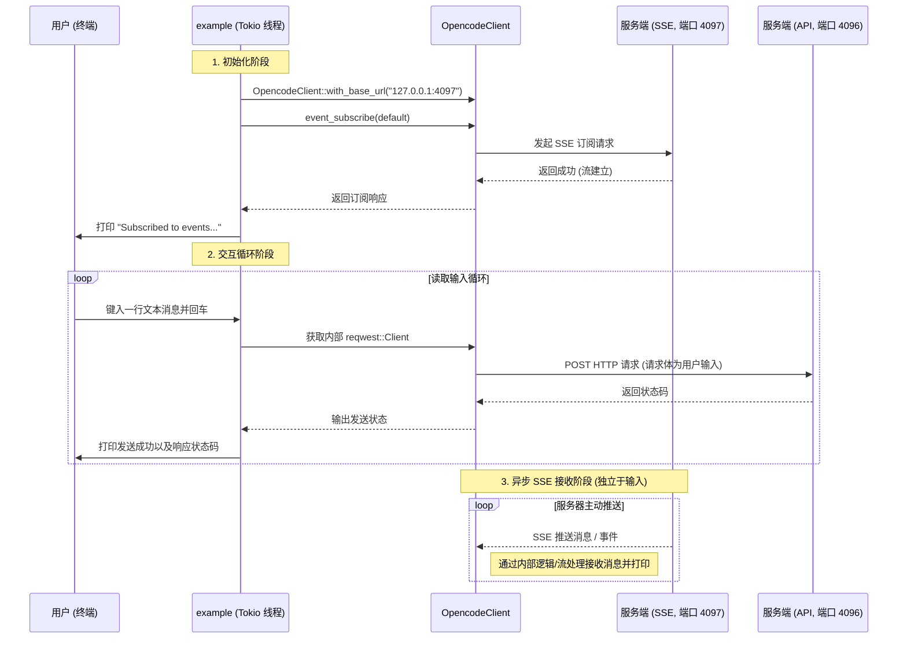

# 交互式 SSE 客户端 (Example) 设计文档

## 1. 概述
本文档描述了 `example.rs` 所实现的一个基于终端的交互式客户端的设计。该客户端主要用于演示如何使用 `OpenCodeClient` 与服务端进行双向通信。
核心能力包括：通过 Server-Sent Events (SSE) 协议订阅并接收服务端的实时事件推送，同时接收用户的终端标准输入（stdin），并通过 HTTP POST 请求将用户消息异步发送至服务端。

## 2. 架构设计

### 2.1 核心组件
该客户端示例采用了轻量级的异步事件流与轮询架构，基于协程（tokio）实现非阻塞的 IO 操作，其核心组件如下：
- **异步运行时 (Tokio Runtime)**: 提供底层 `async/await` 支持，承载标准输入读取、HTTP 请求和 SSE 响应监听。
- **OpenCodeClient**: 封装了所有与后端 API 交互的逻辑。
  - **SSE 订阅模块**: 建立与服务端事件推送端口（目前固定为 `127.0.0.1:4097`）的持久化连接，接收推送。
  - **HTTP 发送模块**: 封装了 `reqwest::Client`，用于将用户提交的消息发送到指控交互端口（目前固定为 `127.0.0.1:4096`）。
- **标准输入监听器 (Stdin BufReader)**: 负责以逐行 (`lines()`) 方式异步读取用户的终端输入。

### 2.2 通信端点
- **SSE 服务端点**: `http://127.0.0.1:4097` (事件订阅)
- **指令服务端点**: `http://127.0.0.1:4096` (消息发送)

## 3. 核心流程与数据流

整体流程分为三个阶段：**初始化与订阅阶段**、**用户交互阶段**以及**事件驱动与异步通信阶段**。

## 4. 模块实现细节

### 4.1 建立 SSE 订阅
在主程序的开始，首先初始化包含 `127.0.0.1:4097` 基础 URL 的 `OpencodeClient` 对象，接着构造默认订阅请求 `EventSubscribeRequest::default()`，调用并 `await` `event_subscribe` 方法确认连接建立。

### 4.2 异步标准输入读取
为了防止终端读取阻塞其他异步任务，示例使用了 `tokio::io::BufReader` 包裹 `tokio::io::stdin()`。在 `while let Some(line) = lines.next_line().await?` 循环中，程序将挂起等待用户输入回车。

### 4.3 消息发送
用户每输入一行（非空行），程序复用 `OpencodeClient` 中已经初始化好的 `reqwest::Client` 实例，主动朝 `http://127.0.0.1:4096` 发起 POST 请求，携带当前行的原始文本。等待返回结果并打印服务端 HTTP 响应码。

## 5. 当前实现的局限性与演进建议

通过评估当前 `example.rs` 的代码，发现其在架构模式和健壮性层面有进一步演进的空间：

1. **并发阻塞处理机制的不足**：
   - 当前在 `main` 函数内采用的是串行执行方式，`while` 循环阻塞在 `stdin`。对于 SSE 连接的流式处理，如果 `event_subscribe` 返回的是一个需要迭代拉取数据包的 `Stream`，那么当前代码并没有开启 `tokio::spawn` 挂载后台流监听任务，导致在阻塞等待标准输入的过程中，可能无法持续读取/消费 SSE 事件。
   - **改进建议**：需使用 `tokio::select!` 宏或使用 `tokio::spawn` 启动独立守护任务来并发处理输入监听与服务器事件接收，实现真正的双工异步非阻塞通信。

2. **硬编码端点配置**：
   - 当前端口（4097 和 4096）及协议头被硬编码在代码内。
   - **改进建议**：引入诸如 `clap` 之类的 CLI 解析库，通过传参提供不同的端口、认证 Token 和请求地址配置。

3. **异常重连（Self-healing）能力缺失**：
   - 如果 SSE 流中断，当前的示例代码在主循环中并没有监控连接状态以及自动重连的机制。
   - **改进建议**：实现基于流闭包的检测与自动重连循环。
